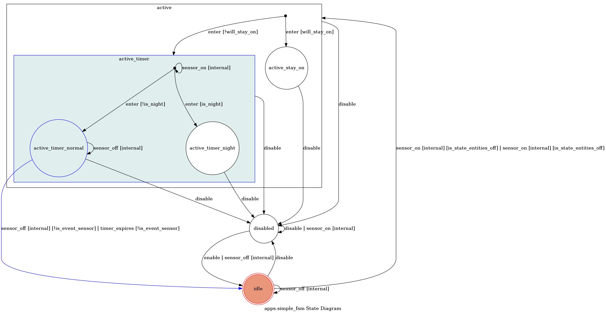
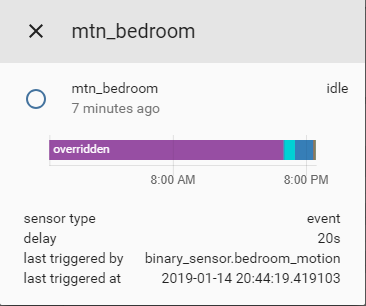
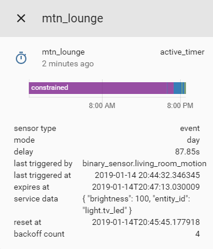
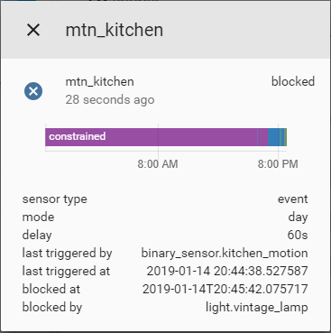

# Introduction
This implementation of motion activated lighting implements a finite state machine to ensure that EntityController does not interfere with the rest of your home automation setup. The use cases for this component are endless because you can use any entity as inputs (there is no restriction to motion sensors and lights).

**Latest stable version `v3.2.0` tested on Home Assistant `v0.88`.**

[Donate to support development and show appreciation](https://www.gofundme.com/danobot&rcid=r01-155117647299-36f7aa9cb3544199&pc=ot_co_campmgmt_w)


# Requirements
Motion lights have the following requirements (R) that I discussed in detail [on my blog](https://www.danielha.tk/2018/05/17/appdaemon-motion-lights.html).

1. turn on when motion is detected
2. turn off when no motion is detected after some timeout
3. Do not interfere with manually activated lights (tricky and less than obvious)

That last one can be separated into the following two requirements:

* (3.1) A light that is already on should not be affected by time outs.
* (3.2) A light that is switched on within the time-out period should have its timer cancelled, and therefore stay on.

This component is by far the most elegant solution I have found for this problem.

# Breaking Changes in `v3.0.0`
The component has been renamed to `entity_controller` and migrated to the new file/directory format. To update your configuration, hard-replace `lightingsm` with `entity_controller` in your YAML and Lovelace configuration. The directory/file format change may require you go into your `custom_components` folder and manually remove the `lightingsm.py` file and create the new directory structure.

# Configuration
The app is quite configurable. In its most basic form, you can define the following.

|Configuration|Description|
|---|---|
|`sensor` entities| Used as triggers. When these entities turn on, your `control` entities will be switched on|
|`control` entities| The entities you wish to switch on and off depending on `sensor` entity states.|
|`state` entities|Unless you wish to use scenes, you need not worry about `state` entities. Essentially, they allow you to define specific entities that will be used for state observation *in cases where `control` entities do not supply a usable state*. (As is the case with `scene`.) Optional.|
|`override` entities| The entities used to override the entire EntityController logic. Optional.|
## Basic Configuration
The controller needs `sensors` to monitor (such as motion detectors, binary switches, doors, etc) as well as an entity to control (such as a light).

```yaml
entity_controller:
  motion_light:
    sensor: binary_sensor.living_room_motion  # required, [sensors]
    entity: light.table_lamp                  # required, [entity,entities,entity_on]
    delay: 300                                # optional, overwrites default delay of 180s
```
**Note:** The top-level domain key `lightingsm` will be omitted in the following examples.

### Using Time Constraints
You may wish to constrain at what time of day your motion lights are activated. You can use the `start_time` and `end_time` parameters for this.
```yaml
motion_light:
  sensor: binary_sensor.living_room_motion
  entity: light.table_lamp
  start_time: '00:00:00'                # required
  end_time: '00:30:00'                  # required
```
Time values relative to sunset/sunrise are supported and use the following syntax:
```yaml
motion_light_sun:
  sensor: binary_sensor.living_room_motion
  entity: light.table_lamp
  start_time: sunset - 00:30:00                # required
  end_time: sunrise + 00:30:00                 # required
```

### Home Assistant State Entities
Since `v1.1.0`, the app creates and updates entities representing the EntityController itself. Beyond basic state (e.g. active, idle, disabled, etc.), this provides additional  state attributes as shown below.





These can be referenced in various `sensor` and `automation` configurations.

### Overrides
You can define entities who block the motion light from turning on if those entities are in any defined `on` state. This allows you to enable/disable your app based on environmental conditions such as "when I am watching TV" or "when the train is late" (seriously...).
```yaml
override_example:
  sensor: 
    - binary_sensor.lounge_motion
    - binary_sensor.lounge_motion_2
  entities:
    - light.tv_led
    - light.lounge_lamp
  delay: 5
  overrides:
    - media_player.tv
    - input_boolean.bedroom_motion_trigger
```

**Note:** `input_boolean`s can be controlled in automations via the `input_boolean.turn_on`, `input_boolean.turn_off` and `input_boolean.toggle` services. This allows you to enable/disable your app based on automations! Services will be implemented in the future such as `entity_controller/enable` for a specific `entity_id`.

### Specifying Custom Service Call Parameters
Any custom service defined in the app configuration will be passed to the `turn_on` and `turn_off` calls of the control entities. Simply add a `service_data` or `service_data_off` field to the root or `night_mode` fields to pass custom service parameters along. An example is shown in _Night Mode_ documentation.

### Night Mode
Night mode allows you to use slightly different parameters at night. The use case for this is that you may want to use a shorter `delay` interval or a dimmed `brightness` level at night (see *Specifying Custom Service Call Parameters* under *Advanced Configuration* for details).

```yaml
motion_light:
  sensor: binary_sensor.living_room_motion
  entity_on: light.tv_led
  delay: 300
  service_data:
    brightness: 80
  night_mode:
    delay: 60
    service_data:
      brightness: 20
    start_time: '22:00:00'                  # required
    end_time: '07:00:00'                    # required
```

### Support for different sensor types
There are two types of motion sensors:
  1. Sends a signal when motion happens (instantaneous event)
  2. Sends a signal when motion happens, stays on for the duration of motion and sends an `off` signal when motion supposedly ceases. (duration)

By default, the app assumes you have a Type 1 motion sensor (event based), these are more useful in home automation because they supply raw, unfiltered and unprocessed data. No assumptions are made about how the motion event data will be used.

In the future, there will be support for listening to HA events as well, which means the need to create 'dummy' `binary_sensors` for motion sensors is removed.

If your sensor emits both `on` and `off` signals, then add `sensor_type: duration` to your configuration. This can be useful for motion sensors, door sensors and locks (not an exhaustive list). By default, the controller treats sensors as `event` sensors.

Control entities are turned off when the following events occur (whichever happens last)
  * the timer expires and sensor is off
  * the sensor state changes to `off` and timer already expired

If you want the timer to be restarted one last time when the sensor returns to `off`, then add `sensor_resets_timer: True` to your entity configuration.

Notation: `[ ]` indicate internal, `( )` indicates external, `...` indicates passage of time, `->` Indicates related action

**Normal sensor**
Idle -> Active Timer -> [timer started] ... [timer expires] -> Idle

**Duration Sensor**
Idle -> Active Timer - [timer started] ... **[Timer expires] ... (sensor goes to off)** -> Idle

**With `sensor_resets_timer`**
Idle -> Active Timer -> [timer started] ... [original timer expires] ... (sensor goes to off) ... **[timer restarted] .. [timer expires]** -> Idle

## Advanced Configuration

### Exponential Backoff
Enabling the `backoff` option will cause `delay` timeouts to increase exponentially by a factor of `backoff_factor` up until a maximum timeout value of `backoff_max` is reached.
The graph below shows the relationship between number of sensor triggers and timeout values for the shown parameters.
```
delay = 60
backoff_factor = 1.1
```


### Calling custom scripts

You may want to call different entities for the `turn_on` and `turn_off` call. This is the case when using custom scripts. You can define `entity_on` and `entity_off`. The app will call the `turn_on` service on both and observe the state using `entity`. (You can pass along custom `service_data` as well to give script inputs.)

```yaml
motion_light:
  sensor: binary_sensor.living_room_motion
  entity: light.led                         # required
  entity_on: script.fade_in_led             # required
  entity_off: script.fade_out_led           # required if `turn_off` does not work on `entity_on`
  
```
### Block Mode Time Restriction
When `block_timeout` is defined, the controller will start a timer when the sensor is triggered and exit `blocked` state once the timeout is reached, thereby restricting the time that a controller can stay `blocked` mode. This is useful when you want the controller to turn off a light that was turned on manually.

The state sequence is as follows:

**Without block_timeout:**
Idle ... (sensor ON) -> Blocked ... **(control entity OFF)** -> Idle
  
**With block_timeout:**
Idle ... (sensor ON) -> Blocked ... **(sensor ON) -> [Timer started] ... [Timer expires]** -> Idle


**Example configuration:**
```yaml
blocked_mode_demo:
  sensor: binary_sensor.living_room_motion
  entity: light.lounge_lamp
  block_timeout: 160                        # in seconds (like all other time measurements)
```

**Note 1:** A controller enters the `blocked` state when a control entity is `on` while a sensor entity is triggered. This means the timer is not started at the moment the light is switched on. Instead, it is started when the sensor is activated. Therefore, if the light is turned off before the controller ever entered `blocked` mode, then the controller remains in `idle` state.

**Note 2:** The entity controller component is designed to avoid any interference with external automations that might affect control entities. Using the `block_timeout` directly violates this principle. If you see unintended interference, reconsider your configuration and remove the `block_timeout` functionality if necessary.

The easiest way to make sense of it is to set up a configuration and explore the different scenarios through every day use. Then re-read the explanation in this document and it will (hopefully) make sense.

### State Entities
It is possible to separate control entities and state entities. **Control entities** are the entities that are being turned on and off by EntityController. **State entities**, on the other hand, are used to observe state. In a basic configuration, your control entities are the same as your state entities (handled internally).

The notion of separate `state entities` allows you to keep the entity that is being controlled separate from the one that is being observed.

Since the release of `v1.0.0` and the introduction of `override` entities, the real use case for `state_entities` is difficult to define.

**Example 1**
One example is my porch light shown below:

```yaml
  mtn_porch:
    sensors: 
      - sensor.cam_front_motion_detected
    entities:
      - light.porch_light
      - script.buzz_doorbell
```

The control entities contains a mix of entities from different domains. The state of the script entitity is non-sensical and causes issues. The controller enters active state, turns on control entities and then immediately leaves active state (going back to idle). This is because the state of the script is interpreted after turn on.

In this case, you need to tell the controller exactly which entitty to observe for state. 
```yaml
  mtn_porch:
    sensors: 
      - binary_sensor.front_motion_detected
    entities:
      - light.porch_light
      - script.buzz_doorbell
    state_entities:
      - light.porch_light
```
**Example 2**
The configuration below will trigger based on the supplied sensors, the entities defined in `entities` will turn on if and only if all `state_entities` states are `false`. The `control` entity is a `scene` which does not provide useful state information as it is in `scening` state at all times.

In general, you can use the config key `entities` and `state_entities` to specify these. For example, 

```yaml
mtn_lounge:
  sensors:
    - binary_sensor.cooking
  entities:
    - scene.cooking
  state_entities:
    - light.kitchen_led_strip
  delay: 300
```

**Note:** Using state entities can have unexpected consequences. For example, if you state entities do not overlap with control entities then your control entities will never turn off. This is the culprit of _advanced configurations_, use at your own risk. If you have problems, make your state entities the same as your control entities, and stick to state entities with a clear state (such as lights, media players etc.)

### Customising State Strings
The following code extract shows the default state strings that were made to represent the `on` and `off` states. These defaults can be overwritten for all entity types using the configuration keys `state_strings_on` and `state_strings_off`. For more granular control, use the entity specific configuration keys shown in the code extract below.

```python
DEFAULT_ON = ["on", "playing", "home"]
DEFAULT_OFF = ["off", "idle", "paused", "away"]
self.CONTROL_ON_STATE = config.get("control_states_on", DEFAULT_ON)
self.CONTROL_OFF_STATE = config.get("control_states_off", DEFAULT_OFF)
self.SENSOR_ON_STATE = config.get("sensor_states_on", DEFAULT_ON)
self.SENSOR_OFF_STATE = config.get("sensor_states_off", DEFAULT_OFF)
self.OVERRIDE_ON_STATE = config.get("override_states_on", DEFAULT_ON)
self.OVERRIDE_OFF_STATE = config.get("override_states_off", DEFAULT_OFF)
self.STATE_ON_STATE = config.get("state_states_on", DEFAULT_ON)
self.STATE_OFF_STATE = config.get("state_states_off", DEFAULT_OFF)
```

### Drawing State Machine Diagrams (not supported yet in `v2`)

You can generate state machine diagrams that update based on the state of the motion light. These produce a file in the file system that can be targeted by `file` based cameras.
```yaml
diagram_test:
  sensors: 
    - binary_sensor.motion_detected
  entities:
    - light.tv_led
  draw: True                                # required, default is False
  image_path: '/conf/temp'                  # optional, default shown
  image_prefix: '/fsm_diagram_'             # optional, default shown

```
# State Meaning

|State|Description|
|---|---|
|idle|Entity observing states, nothing else.|
|active|Momentary, intermediate state to `active_timer`. You won't see this state much as all.|
|active_timer|Control entities have been switched on and timer is running|
|overridden|Entity is overridden by an `override_entity`|
|blocked|Entities in this state wanted to turn on (a sensor entity triggered) but were blocked because one or more `control_entites`/`state_entities` are already in an `on` state. Entity will return to idle state once all `control_entites` (or `state_entities`, if configured) return to `off` state|
|constrained|Current time is outside of `start_time` and `end_time`. Entity is inactive until `start_time`|

Note that, unless you specifically define `state_entities` in your configuration, that `control_entities == state_entities`.
# Debugging
### Time constraint helpers
You can use `soon` and `soon-after` to make the time equal the current time plus 5 and 10 seconds respectively. THis is for testing.

```yaml
soon_test_case:
  sensors:
    - input_boolean.sense_motion2
  entity: light.bed_light
  start_time: soon
  end_time: soon-after
```
# About EntityController 

EntityController is a complete rewrite of the original application (version 0), using the Python `transitions` library to implement a [Finite State Machine](https://en.wikipedia.org/wiki/Finite-state_machine). This cleans up code logic considerably due to the nature of this application architecture.


# Automatic updates
Use the `custom_updater` component to track updates.

```yaml
custom_updater:
  track:
    - components
  component_urls:
    - https://raw.githubusercontent.com/danobot/entity-controller/master/tracker.json
```

# Contributions
All contributions are welcome, including raising issues.


