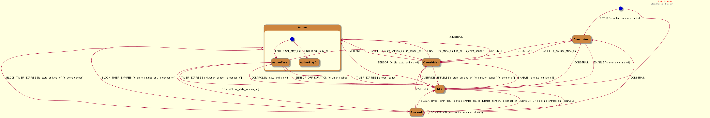
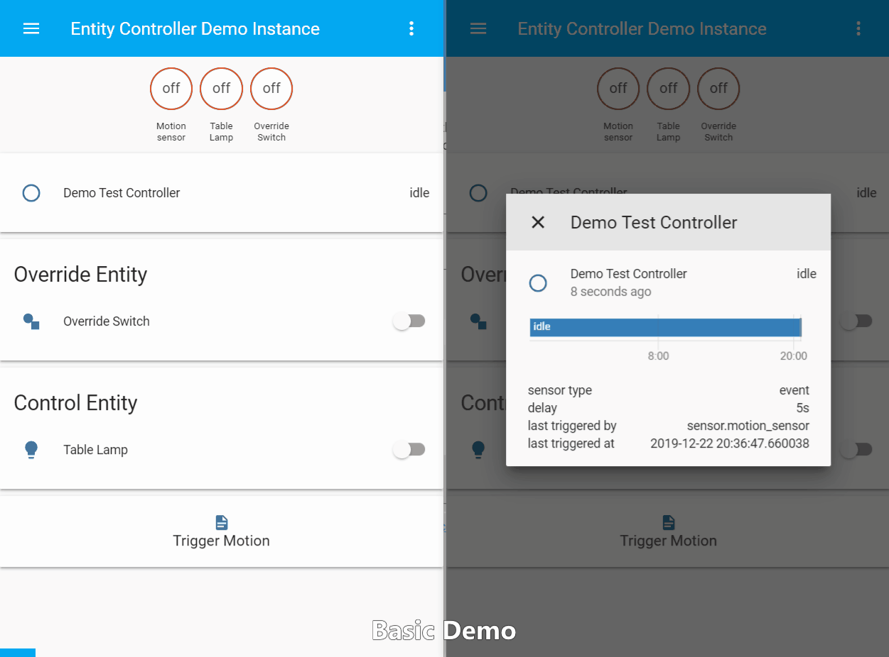
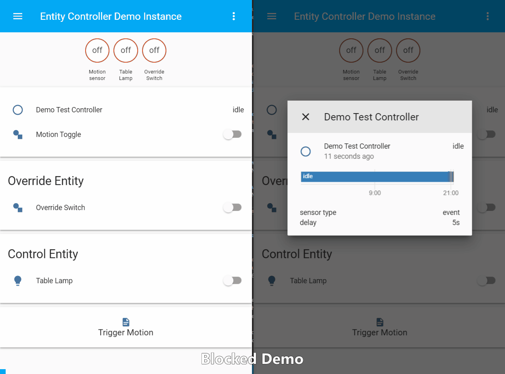
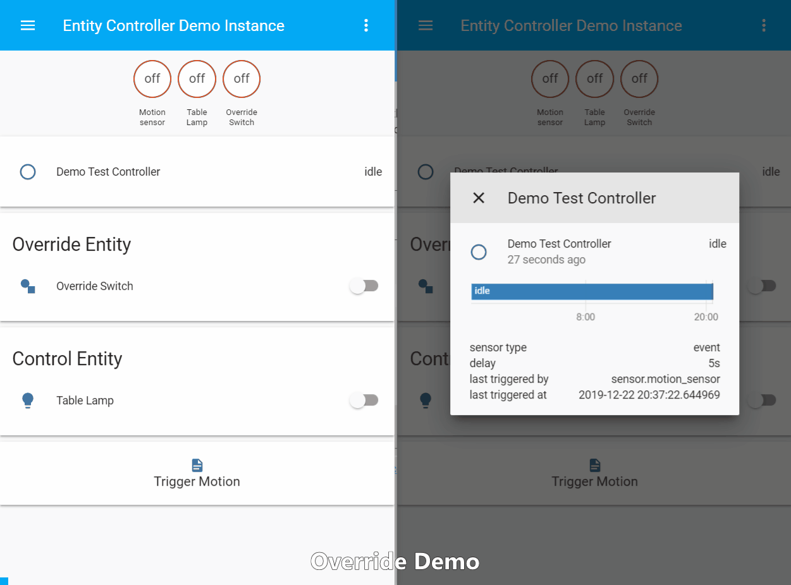
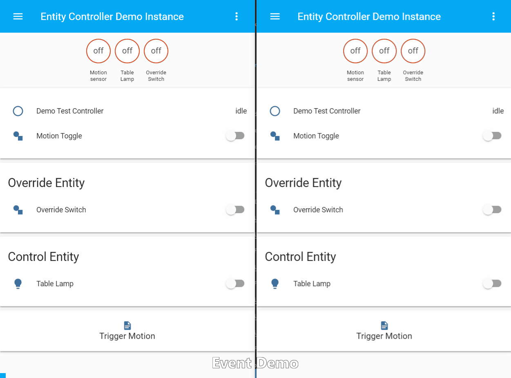
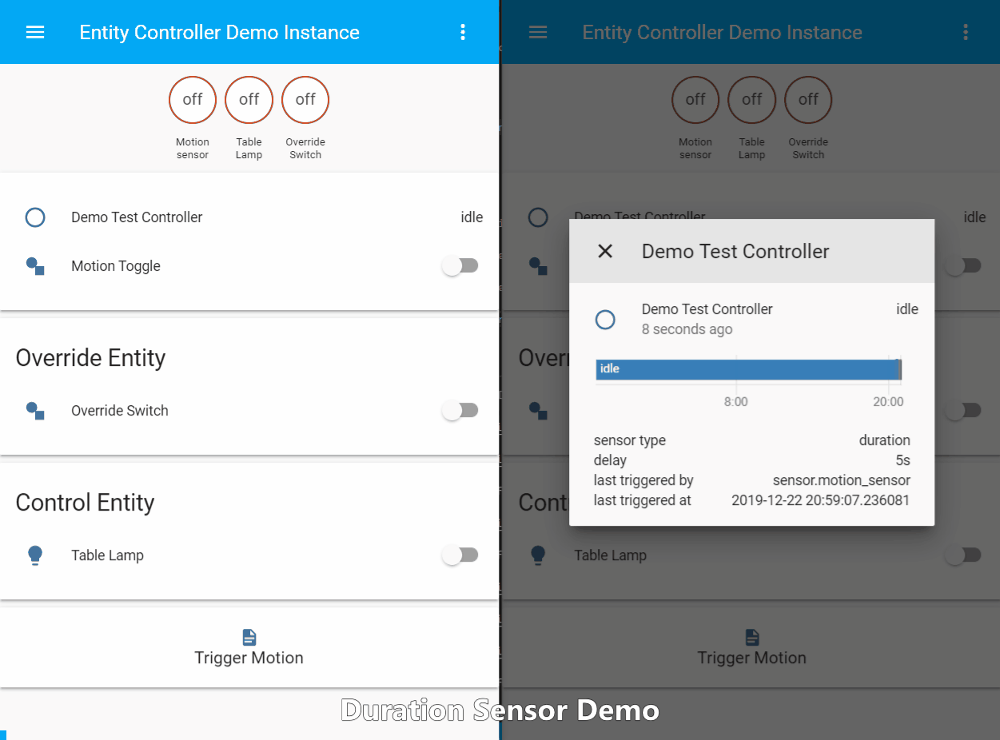
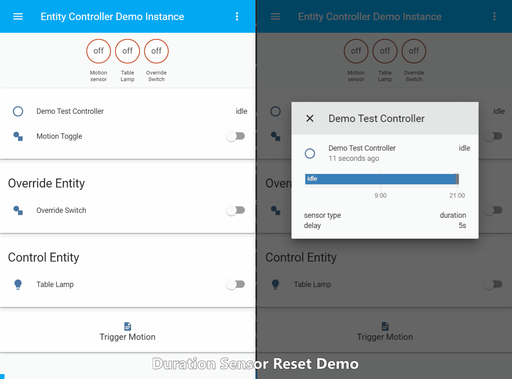
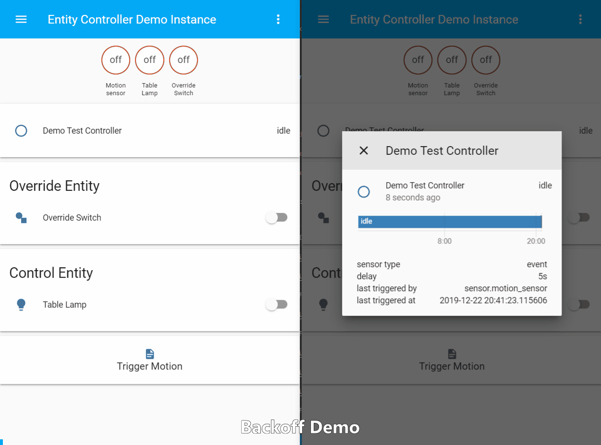
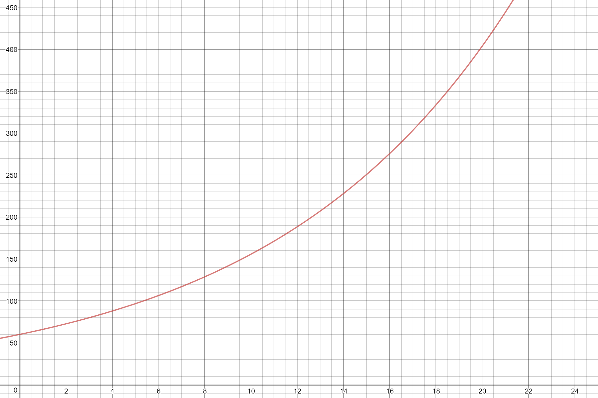
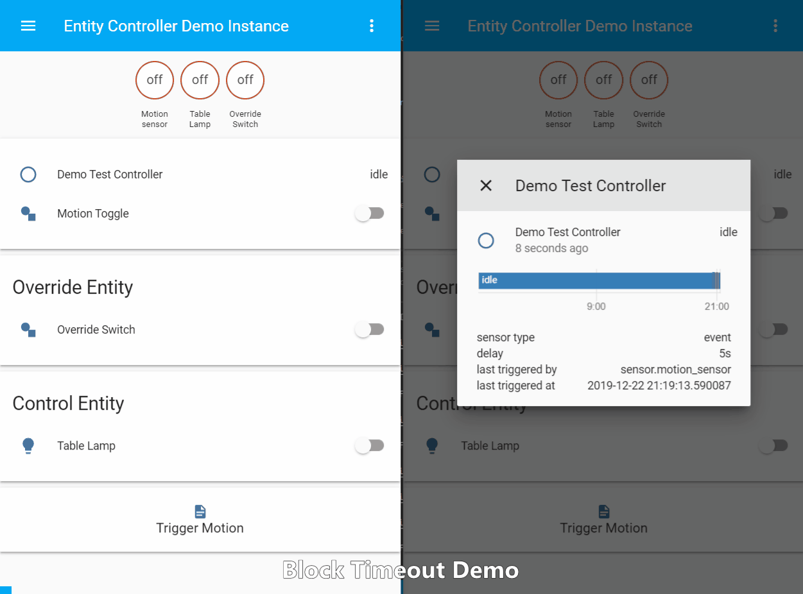

# Introduction
Entity Controller (EC) is an implementation of "When This, Then That for x amount of time" using a finite state machine that ensures basic automations do not interfere with the rest of your home automation setup. This component encapsulates common automation scenarios into a neat package that can be configured easily and reused throughout your home. Traditional automations would need to be duplicated _for each instance_ in your config. The use cases for this component are endless because you can use any entity as input and outputs (there is no restriction to motion sensors and lights).

**Latest stable version `v5.0.2` tested on Home Assistant `0.106.2`.**

## EC Demo House
I created a demo instance which (over time) will showcase all the different EC features.

[Demo Instance](https://ec-demo.danielbkr.net)

**Browser login (Basic Auth)**
```      
Username:                 test
Password:                 ecdemo
```
**Home Assistant Login**
```
Username:                 github
Password:                 W8VfFdKU2zvS3GHV
```

[Buy me a coffee to support ongoing development](https://www.gofundme.com/danobot&rcid=r01-155117647299-36f7aa9cb3544199&pc=ot_co_campmgmt_w)

# Requirements
This component started out as an AppDaemon script implementation of motion activated lighting but it has since been generalised to be able to control any Home Assistant entity. I have discussed the original core requirements for motion lights [on my blog](https://www.danielbkr.net/2018/05/17/appdaemon-motion-lights.html). The basic responsibilities of EC are as follows:
* (1) turn on **control entities** when **sensor entities** are triggered
* (2) turn off **control entities** when **sensor entities** remain off for some time
* (3) Do not interfere with manually controlled entities (tricky and not so obvious)
* (3.1) An entity that is already on should not be affected by time outs. (EC should ignore it and not start a timer,[Read more on my blog...](https://danielbkr.net/2018/03/20/motion-sensor-lights.html#problem-motion-lights-turn-off-manually-controlled-lights-after-time-out-period-expires))
* (3.2) An entity that is manually controlled within the time-out period should have its timer cancelled, and therefore stay on.

In the original context of motion lighting, this means:

* (1) turn on light when motion is detected
* (2) turn off light when no motion is detected for some time
* (3) Do not interfere with manually activated lights 
* (3.1) A light that is already on must not be controlled. (EC should ignore it and not start a timer)
* (3.2) A light that is dimmed (or color changed) within the time-out period should have its EC timer cancelled, and therefore stay on.

This FSM implementation is by far the most elegant solution I have found for this problem as the typical "if/else" algorythm got way out of hand and unmanagable.



## Video Demo
I created the following video to give a high-level overview of all EC features, how they work and how you can configure them for your use cases.

[Youtube Link](https://youtu.be/HJQrA6sFlPs)

<iframe width="560" height="315" src="https://www.youtube.com/embed/HJQrA6sFlPs" frameborder="0" allow="accelerometer; autoplay; encrypted-media; gyroscope; picture-in-picture" allowfullscreen></iframe>

## State Meaning

|State|Description|
|---|---|
|idle|EC is observing states, nothing else.|
|active|Momentary, intermediate state. You won't see EC in this state much at all.|
|active_timer|Control entities have been switched on and timer is running|
|active_stay_on|Control entities have been switched on and will remain on until they are switched off manually.|
|overridden|Entity is overridden by an `override_entity`|
|blocked|When a control entity is already in `on` state and a sensor entity is triggered, EC will enter the `blocked` state. This is to ensure the controller does not interfere with other automations or manual control. The idea is, if the entity is already on, then the problem is already taken care of. EC will return to **idle** state once all `control_entites` return to `off` state.|
|constrained|Current time is outside of `start_time` and `end_time`. EC is inactive until `start_time`.|

Note that `control_entities == state_entities` unless you specifically define `state_entities` in your configuration.


## 📢 Are you a seasoned Python developer? 📢

Help is needed over on issue #101 to get the goodness of automated unit testing going on this project. ✔️🌞💯 

All the boilerplate for Pytest is set up, but I got stuck mocking the passage of time. 😅 [see #101 for details](https://github.com/danobot/entity-controller/issues/101)


# Configuration
EC is very configurable. The following documentation section explain the different ways you can configure EC. In its most basic form, you can define:

|Configuration|Description|
|---|---|
|control entities| The entities you wish to switch on and off depending on _sensor_ entity states. EC will control these entities by turning them on or off.|
|sensor entities| Used as triggers. When these entities turn on, your _control entities_ will be switched on|
|state entities|Unless you wish to use non-stateful entities, you need not worry about state entities. Essentially, they allow you to define specific entities that will be used for state observation *in cases where control entities do not supply a usable state*. (As is the case with `scene`.) Optional.|
|override entities| The entities used to override the entire EC logic. Optional.|

## Basic Configuration
The controller needs `sensors` to monitor (such as motion detectors, binary switches, doors, weather, etc) as well as an entity to control (such as a light).



```yaml
entity_controller:
  motion_light:                               # serves as a name
    sensor: binary_sensor.living_room_motion  # required, [sensors]
    entity: light.table_lamp                  # required, [entity,entities]
    delay: 300                                # optional, overwrites default delay of 180s
```
**Note:** The top-level domain key `entity_controller` will be omitted in the following examples.

**Blocked state demonstration**
R3.1 is implemented using the **blocked** state. See demo below:



### Using Time Constraints
You may wish to constrain at what time of day your motion lights are activated. You can use the `start_time` and `end_time` parameters for this.
```yaml
motion_light:
  sensor: binary_sensor.living_room_motion
  entity: light.table_lamp
  start_time: '00:00:00'                      # required
  end_time: '00:30:00'                        # required
```
Time values relative to sunset/sunrise are supported and use the following syntax:
```yaml
motion_light_sun:
  sensor: binary_sensor.living_room_motion
  entity: light.table_lamp
  start_time: sunset - 00:30:00               # required
  end_time: sunrise + 00:30:00                # required
```

# Stay on
This simple option will keep EC in **active_stay_on** state indefinitely until the control entity is manually turned off.
```yaml
override_example:
  sensor: binary_sensor.lounge_motion
  entity: light.lounge_lamp
  delay: 5
  stay: true
```

### Overrides
You can define entities which stop EC from transitioning into `active` state if those entities are in `on` state. This allows you to enable/disable your controller based on environmental conditions such as "when I am watching TV" or "when the train is late" (seriously...).



```yaml
override_example:
  sensor: 
    - binary_sensor.lounge_motion
    - binary_sensor.lounge_motion_2
  entities:
    - light.tv_led
    - light.lounge_lamp
  delay: 5
  overrides:
    - media_player.tv
    - input_boolean.bedroom_motion_trigger
```

**Note 1** `input_boolean`s can be controlled in automations via the `input_boolean.turn_on`, `input_boolean.turn_off` and `input_boolean.toggle` services. This allows you to enable/disable your app based on automations! Services will be implemented in the future such as `entity_controller/enable` for a specific `entity_id`.

**Note 2:** You will inevitably run into a situation where your entity produces new states that EC does not know about -- a vacuum might be in `vacuuming` state, as opposed to `on`. Check the section on "custom state strings" for information on how to get around this.

### Specifying Custom Service Call Parameters
Any custom service defined in EC configuration will be passed to the `turn_on` and `turn_off` calls of the control entities. Simply add a `service_data` or `service_data_off` field to the root or `night_mode` fields to pass custom service parameters along. An example is shown in _Night Mode_ documentation.

Note that all control entities must support the defined service data parameters. Some entities may reject unknown parameters and throw an error! In that case you may add those entities as activation/deactivation triggers instead.

### Night Mode
Night mode allows you to use slightly different parameters at night. The use case for this is that you may want to use a shorter `delay` interval or a dimmed `brightness` level at night (see *Specifying Custom Service Call Parameters* under *Advanced Configuration* for details).

```yaml
motion_light:
  sensor: binary_sensor.living_room_motion
  entity: light.tv_led
  delay: 300
  service_data:
    brightness: 80
  night_mode:
    delay: 60
    service_data:
      brightness: 20
    start_time: '22:00:00'                  # required
    end_time: '07:00:00'                    # required
```

### Support for different sensor types
There are two types of motion sensors:
  1. Sends a signal when motion happens (instantaneous event)
  2. Sends a signal when motion happens, stays on for the duration of motion and sends an `off` signal when motion supposedly ceases. (duration)

By default, EC assumes you have a Type 1 motion sensor (event based), these are more useful in home automation because they supply raw, unfiltered and unprocessed data. No assumptions are made about how the motion event data will be used. Since entties are stateful, the motion sensor entity in the demo below is on for only a brief period. EC only cares about the state change from `off` to `on`. In the future, there will be support for listening to HA events as well, which means the need to create 'dummy' `binary_sensors` for motion sensors is removed. Check out my [`processor` component](https://github.com/danobot/mqtt_payload_processor) for more info.


If your motion sensor emits both `on` and `off` signals, then add `sensor_type: duration` to your configuration. This can be useful for motion sensors, door sensors and locks (not an exhaustive list). By default, the controller treats sensors as `event` sensors.

Control entities are turned off when the following events occur (whichever happens last):
  * the timer expires and sensor is off
  * the sensor state changes to `off` and timer already expired

The following demo shows the behaviour in those two scenarios:


If you want the timer to be restarted one last time when the sensor returns to `off`, then add `sensor_resets_timer: True` to your entity configuration.

#### Sensor Type Demonstrations

Notation for state transition demonstrations: 
* `[ ]` indicate internal event, 
* `( )` indicates external influence (sensor state change), 
* `...` indicates passage of time,
* `->` Indicates flow

**Normal sensor**

> Idle -> Active Timer -> [timer started] ... [timer expires] -> Idle



**Duration Sensor**

> Idle -> Active Timer -> [timer started] ... **[timer expires] ... (sensor goes to off)** -> Idle



**With `sensor_resets_timer`**

> Idle -> Active Timer -> [timer started] ... [timer expires] ... (sensor goes to off) ... **[timer restarted] ... [timer expires]** -> Idle



### Home Assistant State Entities
Since `v1.1.0`, EC creates and updates entities representing the EC itself. Beyond basic state (e.g. active, idle, overridden, etc.), this provides additional state attributes which update dynamically based on the state of the controller. See GIF animations for examples..

These can be referenced in various `sensor` and `automation` configurations and extracted using `state-attributes-card` and template sensors.

## Advanced Configuration
The following is an example coniguration used to control my outside light at night. The override is used to manually enable or disable this EC instance. Note that EC will call the `turn_on` service on its control entties, meaning you can use it to trigger different types of entities at the same time. My `buzz_short` script emits a short notification tone from a buzzer speaker attached to a Raspberry Pi GPIO pin. (See related [blog post](https://blog.danielbkr.net/2018/07/24/python-docker-mqtt-audio-buzzer.html) and [MQTT Audio Buzzer Repository](https://github.com/danobot/mqtt-audio-buzzer-rpi)).

```yaml
  mtn_outside:
    sensor: 
      - binary_sensor.backyard_motion
      - binary_sensor.shed_door
      - binary_sensor.kitchen_door
      - binary_sensor.mtn_outside_2
    entities:
      - light.outside_light
      - script.buzz_short
    override: 
      - input_boolean.outside_motion
    state_entities:
      - light.outside_light
    delay: 120
    backoff: true
    start_time: 'sunset - 01:00:00'
    end_time: 'sunrise + 01:00:00'
```

### Exponential Backoff
Enabling the `backoff` option will cause `delay` timeouts to increase exponentially by a factor of `backoff_factor` up until a maximum timeout value of `backoff_max` is reached.



The graph below shows the relationship between number of sensor triggers and timeout values for the shown parameters.
```
delay = 60
backoff_factor = 1.1
```



### Calling custom scripts

You may want to use the activation and deactivation of EC as a trigger for some other entity (most like a script). For the `turn_on`. You can define `trigger_on_activate` and `trigger_on_deactivate`. The controller will call the `turn_on` service on both and observe the state using `entity`. These trigger entities:
* do not receive custom service data (as they may not require it)
* have only the `turn_on` service is called on  (as they may not support anything else)
* will not have ther state observed (as it may be meaningless, like for Script entities.)

These are the primary reasons why you might need the trigger entities in your configuration.

```yaml
motion_light:
  sensor: binary_sensor.living_room_motion
  entity: light.led                         # required
  trigger_on_activate: script.fade_in_led             # required
  trigger_on_deactivate: script.fade_out_led           # required if `turn_off` does not work for the entity you want to control, e.g. scripts
```

### Block Mode Time Restriction
When `block_timeout` is defined, the controller will start a timer when the sensor is triggered and exit `blocked` state once the timeout is reached, thereby restricting the time that a controller can stay `blocked` mode. This is useful when you want the controller to turn off a light that was turned on manually.

The state sequence is as follows:

**Without block_timeout:**

> Idle ... (sensor ON) -> Blocked ... **(control entity OFF)** -> Idle
  

**With block_timeout:**

> Idle ... (sensor ON) -> Blocked ... **(sensor ON) -> [Timer started] ... [Timer expires]** -> Idle




**Example configuration:**
```yaml
blocked_mode_demo:
  sensor: binary_sensor.living_room_motion
  entity: light.lounge_lamp
  block_timeout: 160                        # in seconds (like all other time measurements)
```

**Note 1:** EC enters the `blocked` state when a control entity is `on` while a sensor entity is triggered. This means the timer is not started at the moment the light is switched on. Instead, it is started when the sensor is activated. Therefore, if the light is turned off before the controller ever entered `blocked` mode, then the controller remains in `idle` state.

**Note 2:** EC is designed to avoid any interference with external automations that might affect control entities. Using the `block_timeout` directly violates this principle. If you see unintended interference, reconsider your configuration and remove the `block_timeout` functionality if necessary.

The easiest way to make sense of it is to set up a configuration and explore the different scenarios through every day use. Then re-read the explanation in this document and it will (hopefully) make sense.

### State Entities
It is possible to separate control entities and state entities. **Control entities** are the entities that are being turned on and off by EC. **State entities**, on the other hand, are used to observe state. In a basic configuration, your control entities are the same as your state entities (handled internally).

The notion of separate `state entities` allows you to keep the entity that is being controlled separate from the one that is being observed.

Since the release of `v1.0.0` and the introduction of `override` entities, the real use case for `state_entities` is difficult to define.

**Example 1**
One example is my porch light shown below:

```yaml
  mtn_porch:
    sensors: 
      - sensor.cam_front_motion_detected
    entities:
      - light.porch_light
      - script.buzz_doorbell
```

The control entities contains a mix of entities from different domains. The state of the script entitity is non-sensical and causes issues. The controller enters active state, turns on control entities and then immediately leaves active state (going back to idle). This is because the state of the script is interpreted after turn on.

In this case, you need to tell the controller exactly which entitty to observe for state. 
```yaml
  mtn_porch:
    sensors: 
      - binary_sensor.front_motion_detected
    entities:
      - light.porch_light
      - script.buzz_doorbell
    state_entities:
      - light.porch_light
```
**Example 2**
The configuration below will trigger based on the supplied sensors, the entities defined in `entities` will turn on if and only if all `state_entities` states are `false`. The `control` entity is a `scene` which does not provide useful state information as it is in `scening` state at all times.

In general, you can use the config key `entities` and `state_entities` to specify these. For example, 

```yaml
mtn_lounge:
  sensors:
    - binary_sensor.cooking
  entities:
    - scene.cooking
  state_entities:
    - light.kitchen_led_strip
  delay: 300
```

**Note:** Using state entities can have unexpected consequences. For example, if you state entities do not overlap with control entities then your control entities will never turn off. This is the culprit of _advanced configurations_, use at your own risk. If you have problems, make your state entities the same as your control entities, and stick to state entities with a clear state (such as lights, media players etc.)

## Automation Support and Services

### Entity Services

The entity controller support a few services that can be used to extend the customization of the entity.

#### Stay

```yaml
service: entity_controller.set_stay_on
  entity_id: entity_controller.motion
```

This service takes an entity id and will set the stay flag to on

```yaml
service: entity_controller.set_stay_off
  entity_id: entity_controller.motion
```

This service takes an entity id and will clear the stay flag.

**Note:** There is no attribute that exposes the stay flag state at this time.

#### Clearing Blocking State

```yaml
service: entity_controller.clear_block
  entity_id: entity_controller.motion
```

This service will clear the blocking state, if it is set, the same as if the block timer was run down.
This allows for automations to react to the entity being blocked by a light on and clear the state is needed.

**Example**
```yaml
automations:
- id: example
  trigger:
  - platform: state
      entity_id: entity_controller.motion
      to: blocking
      for: 00:01:00
  action:
  - service: entity_controller.clear_block
    entity_id: entity_controller.motion
```
**Note:** The above example is functionally equivalent to setting a block timeout in the configuration.

#### Set Night Mode

```yaml
service: entity_controller.set_night_mode
  entity_id: entity_controller.motion
  data:
    start_time: now
    end_time: constraint
```

This service is for customizing the night mode settings for more dynamic scripts. It will set the night mode start 
and stop times to the times specified. If only one or both times are provided, only those times are changed. If 
no time is provided night mode is effectivly disabled by setting both the start and end to midnight. This service takes
the same time rules as the configuration, plus supports two additional options that make sense with automations.

```yaml
start_time: now
```

This will set the start (or end) night mode time to the current time. This is usefull for turning night mode on or off instantly.

```yaml
end_time: constraint
```

This will set the end (or start) night mode time to the appropriate constraint time (start or end.) This is handy for starting or making
night mode last the same as the configured constraints. **Note:** This has no meaning if constraints are not set, so it would be equivilent to not providing a value.

### Custom State Strings
The following code extract shows the default state strings that were made to represent the `on` and `off` states. These defaults can be overwritten for all entity types using the configuration keys `state_strings_on` and `state_strings_off`. For more granular control, use the entity specific configuration keys shown in the code extract below.

```python
DEFAULT_ON = ["on", "playing", "home"]
DEFAULT_OFF = ["off", "idle", "paused", "away"]
self.CONTROL_ON_STATE = config.get("control_states_on", DEFAULT_ON)
self.CONTROL_OFF_STATE = config.get("control_states_off", DEFAULT_OFF)
self.SENSOR_ON_STATE = config.get("sensor_states_on", DEFAULT_ON)
self.SENSOR_OFF_STATE = config.get("sensor_states_off", DEFAULT_OFF)
self.OVERRIDE_ON_STATE = config.get("override_states_on", DEFAULT_ON)
self.OVERRIDE_OFF_STATE = config.get("override_states_off", DEFAULT_OFF)
self.STATE_ON_STATE = config.get("state_states_on", DEFAULT_ON)
self.STATE_OFF_STATE = config.get("state_states_off", DEFAULT_OFF)
```
### Drawing State Machine Diagrams (not supported yet in `v2`)

You can generate state machine diagrams that update based on the state of the motion light. These produce a file in the file system that can be targeted by `file` based cameras.
```yaml
diagram_test:
  sensors: 
    - binary_sensor.motion_detected
  entities:
    - light.tv_led
  draw: True                                # required, default is False
  image_path: '/conf/temp'                  # optional, default shown
  image_prefix: '/fsm_diagram_'             # optional, default shown

```

### Customize which attribute changes are considered "manual control"

By default, any attribute change is considered significant and will qualify for entering the `blocked` state. However, in certain cases, you might want to ignore certain changes. For example, when using a component like f.lux or circadianlighting, the brightness and color temperature will be updated automatically, and this is not indicative of a manual change. For these cases, add a `state_attributes_ignore` field:

```yaml
  mtn_office:
    sensor: binary_sensor.office_motion
    trigger_on_activate: light.office_led
    delay: 120
    state_attributes_ignore:
        - brightness
        - color_temp
```

# Debugging

## Enabling Debug Logging
Check the `logger` component. Adding the following should print debug logs for `entity_controller`.
If you have multiple instances, you can narrow down logs by adding the instance name. e.g. `custom_components.entity_controller.motion_lounge`.

Note that the default logging is `critical` to allow you to focus on EC log output.

```yaml
logger:
  default: critical
  logs:
    custom_components.entity_controller: debug

```


### Time constraint helpers
You can use `soon` and `soon-after` to make the time equal the current time plus 5 and 10 seconds respectively. THis is for testing.

```yaml
soon_test_case:
  sensors:
    - input_boolean.sense_motion2
  entity: light.bed_light
  start_time: soon
  end_time: soon-after
```
# About Entity Controller 

EC is a complete rewrite of the original application (version 0), using the Python `transitions` library to implement a [Finite State Machine](https://en.wikipedia.org/wiki/Finite-state_machine). This cleans up code logic considerably due to the nature of this application architecture.

## Related Research and Development

* [Motion Lighting - first steps (superceded)](https://danielbkr.net/2018/03/20/motion-sensor-lights.html)
* [Motion Lighting requirements - A complete guide](https://danielbkr.net/2018/05/17/appdaemon-motion-lights.html)
* [Home Assistant priority locks concept](https://danielbkr.net/2018/08/25/ha-priority-locks.html)
* [How to: Set up Stateless Motion Binary Sensors](https://danielbkr.net/2018/03/19/rf-binary-sensors.html)

# Automatic updates using HACS
EC is available on the Home Assistant Community Store (HACS). This is the recommended installation method to benefit from automated updates and quick release adoption. 

# Contributions
All contributions are welcome, including raising issues. Expect to be involved in the resolution of any issues. 

The `close-issue` bot is ruthless. Please provide all requested information to allow me to help you.


