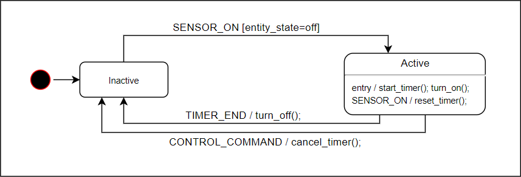

# Introduction
This implementation of motion activated lighting implements a finite state machine to ensure that `MotionLight`s do not interfere with the rest of your home automation setup.


# Requirements
Motion lights have the following requirements (R) that I discussed in detail [on my blog](https://www.danielha.tk/2018/05/17/appdaemon-motion-lights.html).

1. turn on when motion is detected
2. turn off when no motion is detected after some timeout
3. Do not interfere with manually activated lights (tricky and less than obvious)

That last one can be separated into the following two requirements:

3.1 A light that is already on should not be affected by time outs.
3.2 A light that is switched on within the time-out period should have its timer cancelled, and therefore stay on.

This AppDaemon app is by far the most elegant solution I have found for this problem.

# Configuration
The app is quite configurable. In its most basic form, you can define the following.

**Basic Configuration**
`MotionLight` needs a `binary_sensor` to monitor as well as an entity to control.

```yaml
motion_light:
  module: motion_lights
  class: MotionLights
  sensor: binary_sensor.living_room_motion  # required
  entity_on: light.table_lamp               # required
  delay: 300                                # optional, overwrites default delay of 180s
```

**Using AppDaemon Constraints**
You may wish to constrain at what time of day your MOtionLights are activated. You can use AppDaemon's contraint mechanism for this.
```yaml
motion_light:
  module: motion_lights
  class: MotionLights
  sensor: binary_sensor.living_room_motion
  entity_on: light.table_lamp
  constrain_start_time: sunset - 00:00:00
  constrain_end_time: sunrise + 00:30:00
```
**Advanced Parameters**
```yaml
motion_light:
  module: motion_lights
  class: MotionLights
  sensor: binary_sensor.living_room_motion
  entity_on: light.tv_led                   # LED strip supports `brightness`
  brightness: 80                            # Go to 80% brightness
  override_switch: input_boolean.my_toggle  # Toggle switch to disable motion light altogether. 
```

**Note:** `input_boolean`s can be controlled in automations via the `input_boolean.turn_on`, `input_boolean.turn_off` and `input_boolean.toggle` services. This allows you to enable/disable your MotionLights based on automations!

## Night Mode
Night mode allows you to use slightly different parameters at night. The use case for this is that you may want to use a shorter `delay` interval at night as people are typically asleep and the light may only need to stay on for a minute. Adjusting a custom night time brightness is useful as well.

```yaml
motion_light:
  module: motion_lights
  class: MotionLights
  sensor: binary_sensor.living_room_motion
  entity_on: light.tv_led
  delay: 300
  brightness: 80
  night_mode:
    delay: 60
    brightness: 20
    start_time: '22:00:00'                  # required
    end_time: '07:00:00'                    # required
```

## Advanced Configuration

### State Entities
It is possible to separate control entities and state entities. You can use the config key `entities` and `state_entities` to define these. For example, the configuration below will trigger based on the supplied sensors, the entities defined in `entities` will turn on if and only if the Boolean OR combination of all `state_entities` evaluates to `False` (all state entities are off).

The use case here is that I do not want the `MotionLight` to turn on when I am watching TV.
```yaml
mtn_lounge:
  module: motion_lights
  class: MotionLights
  # entity: light.tv_led
  sensors:
    - binary_sensor.living_room_motion
    - binary_sensor.hallway_motion
  state_entities:
    - light.living_room_floor_lamp
    - binary_sensor.tv_on
  entities:
    - light.tv_led
    - light.living_room_floor_lamp
  delay: 300
```

Note: This can have unexpected consequences. For example, if you `state_entities` do not overlap with control `entities` then your MotionLight might never turn off unless you intervene. (This is because the MotionLight does not turn off the light.) Use this advanced feature at your own risk.

You cannot use `entity`, `entity_on` or `entities` at the same time. Only one must be defined. If more than one is defined, the first one in the following list will be applied:
1. `entity_on`
2. `entity`
3. `entities`

For state entities, a similar logic applies. only one of `entity`, `entity_on` or `state_entities` will be used to determine state of MotionLight and they are chosen in the following order:
1. `state_entities`
2. `entities`
3. `entity`
4. `entity_on`

These parameters are advanced and should be used with caution.
**Calling custom scripts**

You may use custom scripts to control a `light` entity with more precision. This is the case when the `entity_on` entity does not support a `turn_off` service call or use want to pass custom service parameters to the service call. You can define `entity_on` and `entity_off`. The `MotionLight` will call the `turn_on` service on both and observe the state using `entity`.

```yaml
motion_light:
  module: motion_lights
  class: MotionLights
  sensor: binary_sensor.living_room_motion
  entity: light.led                         # required
  entity_on: script.fade_in_led             # required
  entity_off: script.fade_out_led           # required if `turn_off` does not work on `entity_on`
  
```

**MQTT Topic (to be implemented)**

Supplying the top-level `topic` parameter allows the MotionLight to react to MQTT messages. This is used to cancel any pending motion timeouts when the entity is controlled through some other means, for example another automation (refer to state diagram `CONTROL_COMMAND` event). This mechanism is yet to be implemented and tested.

```yaml
motion_light:
  module: motion_lights
  class: MotionLights
  sensor: binary_sensor.living_room_motion # required
  entity_on: light.table_lamp
  topic: "cmnd/table_lamp/POWER"
```

# Automatic updates
Use the `custom_updater` component to track updates.

```yaml
custom_updater:
  track:
    - components
  component_urls:
    - https://raw.githubusercontent.com/danobot/appdaemon-motion-lights/master/tracker.json
```