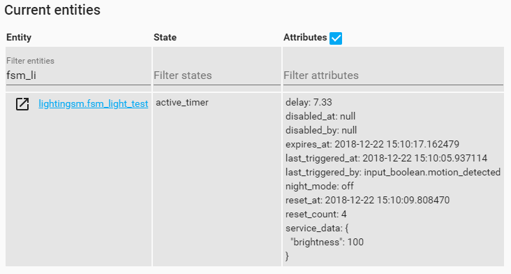

# Introduction
This implementation of motion activated lighting implements a finite state machine to ensure that `MotionLight`s do not interfere with the rest of your home automation setup.


# Requirements
Motion lights have the following requirements (R) that I discussed in detail [on my blog](https://www.danielha.tk/2018/05/17/appdaemon-motion-lights.html).

1. turn on when motion is detected
2. turn off when no motion is detected after some timeout
3. Do not interfere with manually activated lights (tricky and less than obvious)

That last one can be separated into the following two requirements:

3.1 A light that is already on should not be affected by time outs.
3.2 A light that is switched on within the time-out period should have its timer cancelled, and therefore stay on.

This component is by far the most elegant solution I have found for this problem.

# Breaking Changes
The application was converted to a native Home Assistant component. Appdaemon is no longer required. To receive future updates, update your HA configuration by adding the `lightingsm` top-level configuration key and inside a list of motion lights as shown in the examples below.

# Configuration
The app is quite configurable. In its most basic form, you can define the following.

## Basic Configuration
`MotionLight` needs a `binary_sensor` to monitor as well as an entity to control.

```yaml
lightingsm:
  motion_light:
    sensor: binary_sensor.living_room_motion  # required
    entity: light.table_lamp                  # required, [entity,entities,entity_on]
    delay: 300                                # optional, overwrites default delay of 180s
```

### Using AppDaemon Constraints (not supported yet in v2.0.0)
You may wish to constrain at what time of day your motion lights are activated. You can use AppDaemon's constraint mechanism for this.
```yaml
motion_light:
  sensor: binary_sensor.living_room_motion
  entity: light.table_lamp
  start_time: sunset - 00:00:00                # Not supported yet in v2.0.0
  end_time: sunrise + 00:30:00                 # Not supported yet in v2.0.0
```

### Home Assistant State Entities
Since `v1.1.0`, the app creates and updates entities representing the motion light itself. Beyond basic state (e.g. active, idle, disabled, etc.), this provides additional  state attributes as shown below.



These can be referenced in various `sensor` and `automation` configurations.

### Overrides
You can define entities who block the motion light from turning on if those entities are in any defined `on` state. This allows you to enable/disable your app based on environmental conditions such as "when I am watching TV" or "when the train is late" (seriously...).
```yaml
override_example:
  module: lighting_sm
  class: LightingSM
  sensors: 
    - input_boolean.motion_detected
  entities:
    - light.tv_led
  delay: 5
  overrides:
    - media_player.tv
    - input_boolean.bedroom_motion_trigger
```

**Note:** `input_boolean`s can be controlled in automations via the `input_boolean.turn_on`, `input_boolean.turn_off` and `input_boolean.toggle` services. This allows you to enable/disable your app based on automations!


### Night Mode
Night mode allows you to use slightly different parameters at night. The use case for this is that you may want to use a shorter `delay` interval at night as people are typically asleep and the light may only need to stay on for a minute. Adjusting a custom night brightness is useful as well. (see *Specifying Custom Service Call Parameters* under *Advanced Configuration* for details.)

```yaml
motion_light:
  module: lighting_sm
  class: LightingSM
  sensor: binary_sensor.living_room_motion
  entity_on: light.tv_led
  delay: 300
  service_data:
    brightness: 80
  night_mode:
    delay: 60
    service_data:
      brightness: 20
    start_time: '22:00:00'                  # required
    end_time: '07:00:00'                    # required
```

### Support for different sensor types
There are two types of motion sensors:
  1. Sends a signal when motion happens (instantaneous event)
  2. Sends a signal when motion happens, stays on for the duration of motion and sends an `off` signal when motion supposedly ceases. (duration)

By default, the app assumed you have a Type 1 motion sensor (event based), these are more useful in home automation because they supply raw, unfiltered and unprocessed data. No assumptions are made about how the motion event data will be used.

If your motion sensor emits both `on` and `off` signals, then add `sensor_type_duration: True` to your configuration.

Control entities are turned off when the following events occur (whichever happens last)
  * the timer expires
  * the sensor is turned off

## Advanced Configuration
### Specifying Custom Service Call Parameters
Any custom `service_data` defined in the app configuration will be passed to the `turn_on` call of the control entities. Simply add a `service_data` field to the root or `night_mode` fields to pass custom service parameters along.

### Exponential Backoff
Enabling the `backoff` option will cause `delay` timeouts to increase exponentially by a factor of `backoff_factor` up until a maximum timeout value of `backoff_max` is reached.
The graph below shows the relationship between number of sensor triggers and timeout values for the shown parameters.
```
delay = 60
backoff_factor = 1.1
```


### Calling custom scripts

You may want to call different entities for the `turn_on` and `turn_off` call. This is the case when using custom scripts. You can define `entity_on` and `entity_off`. The app will call the `turn_on` service on both and observe the state using `entity`. (You can pass along custom `service_data` as well to give script inputs.)

```yaml
motion_light:
  sensor: binary_sensor.living_room_motion
  entity: light.led                         # required
  entity_on: script.fade_in_led             # required
  entity_off: script.fade_out_led           # required if `turn_off` does not work on `entity_on`
  
```
### State Entities
It is possible to separate control entities and state entities. **Control entities** are the entities that are being turned on and off by the application. **State entities**, on the other hand, are used to observe state. In a basic configuration, your control entities are the same as your state entities (If the light already on, you dont want to start a timer and turn it off). The notion of separate state entities allows you to keep the entity tat is being controlled separate from the one that is being observed.

Since the release of `v1.0.0` and the introduction of `override` entities, the real use case for `state_entities` is difficult to define. I did not remove the feature, just in case it provides some people with some additional flexibility.

You can use the config key `entities` and `state_entities` to define these. For example, the configuration below will trigger based on the supplied sensors, the entities defined in `entities` will turn on if and only if all `state_entities` states are `false`.


```yaml
mtn_lounge:
  sensors:
    - binary_sensor.living_room_motion
    - binary_sensor.hallway_motion
  state_entities:
    - light.living_room_floor_lamp
    - binary_sensor.tv_on
  entities:
    - light.tv_led
    - light.living_room_floor_lamp
  delay: 300
```

Note: This can have unexpected consequences. For example, if you `state_entities` do not overlap with control `entities` then your light might never turn off unless you intervene. (This is because the motion light does not turn off the light.) Use this advanced feature at your own risk.

These parameters are advanced and should be used with caution.

### Drawing State Machine Diagrams

You can generate state machine diagrams that update based on the state of the motion light. These produce a file in the file system that can be targeted by `file` based cameras.
```yaml
diagram_test:
  sensors: 
    - binary_sensor.motion_detected
  entities:
    - light.tv_led
  draw: True                                # required, default is False
  image_path: '/conf/temp'                  # optional, default shown
  image_prefix: '/fsm_diagram_'             # optional, default shown

```

# About LightingSM 

`LightingSM` is a complete rewrite of the original application (version 0), using the Python `transitions` library to implement a [Finite State Machine](https://en.wikipedia.org/wiki/Finite-state_machine). This cleans up code logic considerably due to the nature of this application architecture.


# Automatic updates
Use the `custom_updater` component to track updates.

```yaml
custom_updater:
  track:
    - components
  component_urls:
    - https://raw.githubusercontent.com/danobot/appdaemon-motion-lights/master/tracker.json
```