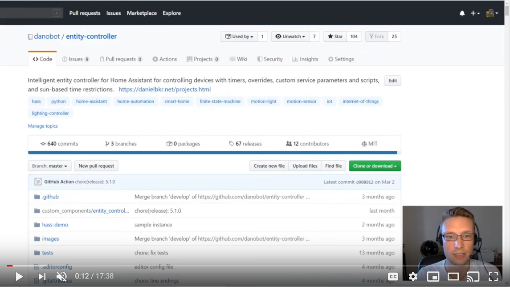

[](https://github.com/danobot/entity-controller/blob/develop/COPYING)
[](https://danielbkr.net/?utm_source=github&utm_medium=badge&utm_campaign=entity-controller)
[](https://paypal.me/danielb160)
[](https://gofund.me/7a2487d5)

Entity Controller (EC) is an implementation of "When This, Then That" using a finite state machine that ensures basic automations do not interfere with the rest of your home automation setup. This component encapsulates common automation scenarios into a neat package that can be configured easily and reused throughout your home. Traditional automations would need to be duplicated _for each instance_ in your config. The use cases for this component are endless because you can use any entity as input and outputs (there is no restriction to motion sensors and lights).


## :clapper: Video Demo
I created the following video to give a high-level overview of all EC features, how they work and how you can configure them for your use cases.

[](https://youtu.be/HJQrA6sFlPs)

## Basic Configuration
The controller needs `sensors` to monitor (such as motion detectors, binary switches, doors, weather, etc) as well as an entity to control (such as a light).

```yaml
entity_controller:
  motion_light:                               # serves as a name
    sensor: binary_sensor.living_room_motion  # required, [sensors]
    entity: light.table_lamp                  # required, [entity,entities]
    delay: 300                                # optional, overwrites default delay of 180s
```
## Support
Maintaining and improving this integration is very time consuming because of the sheer number of supported use cases. If you use this component in your home please consider donating or checking the issue tracker to help with the implementation of new features.

[Buy me a coffee](https://gofund.me/7a2487d5)

## Full Documentation
[Documentation](https://github.com/danobot/entity-controller)
